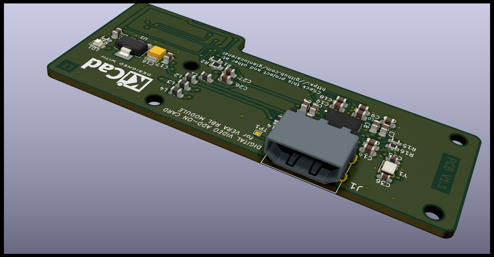
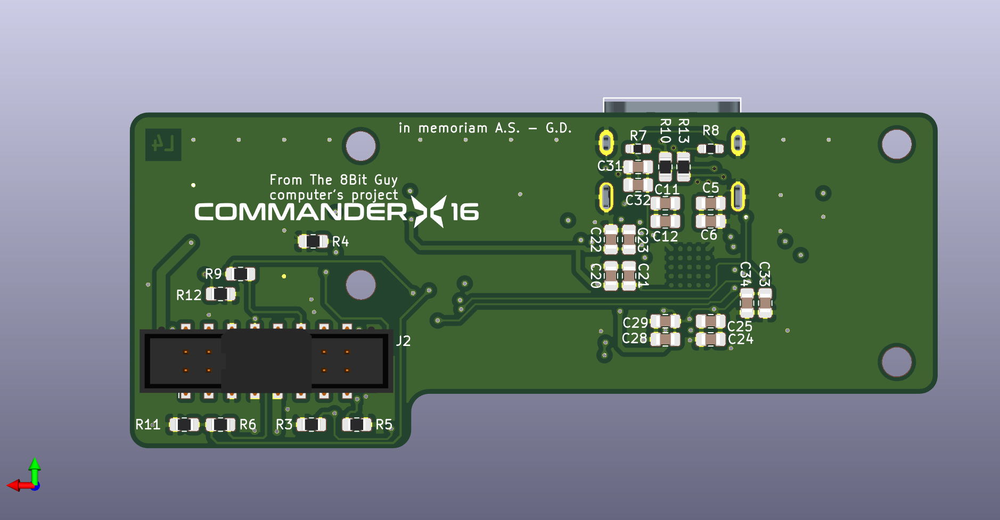

# VERA-HDMI-Expansion

  

  An open-source HDMI expansion board for the <strong>VERA-MODULE-RBL</strong> video module.

---

## 📖 Overview

This project provides the complete design files for an HDMI expansion board specifically created for the **VERA-MODULE-RBL**. Its purpose is to convert the VERA module's native video signal into a standard HDMI output, allowing it to be easily connected to modern monitors and TVs.

The project was designed in KiCad, and all source files are included for viewing, modification, and manufacturing.

## ✨ Key Features

- 🔌 **Native HDMI Output:** Delivers a clean digital signal for maximum video quality.
- 🧩 **Compact Design:** Engineered to integrate seamlessly with the VERA-MODULE-RBL.
- ⚙️ **MS9288-Based:** Utilizes a dedicated chip for digital video to HDMI conversion.
- 📂 **Open Source:** All KiCad design files are freely available in this repository.

## 🛠️ How It Works

The board connects directly to the VERA-MODULE-RBL. The heart of the circuit is the **MS9288A/C** video converter chip, a specialized IC that receives digital video data from the VERA module, processes it, and encodes it into a TMDS (Transition-Minimized Differential Signaling) signal compatible with the HDMI standard.

This signal is then exposed via a standard HDMI connector, ready to be plugged into any modern display.

---

## 📚 Project Files & Documentation

### Schematic

The complete circuit schematic is available as a PDF for easy viewing.

- **[➡️ View Schematic (PDF)](VERA-HDMI-Expansion.pdf)**

### Bill of Materials (BOM)

An interactive HTML Bill of Materials (iBOM) is provided to simplify component identification and assembly.

- **[➡️ Open Interactive BOM](BOM/ibom.html)**

---

## 🏭 Manufacturing

This repository contains all the necessary files for board production, including:
- KiCad source files (`.kicad_pcb`, `.sch`).
- Python scripts (`generate_cpl.py`, `jlcpcb-check-bom.py`) to automate the generation of Component Placement Lists (CPL) and to verify the BOM against JLCPCB's library.
- Manufacturing outputs in the `production/` directory.

### Board Renders

<table align="center">
  <tr>
    <td align="center"><strong>Top View</strong></td>
    <td align="center"><strong>Bottom View</strong></td>
  </tr>
  <tr>
    <td></td>
    <td></td>
  </tr>
</table>

---

## 📜 License

This project is released under the terms specified in the [LICENSE](LICENSE) file.